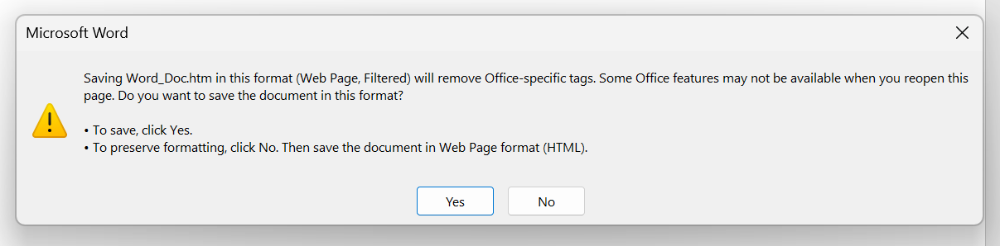

# .docx -> FILTERED .htm -> cleaned-up .html

A Pen created on CodePen.io. Original URL: [https://codepen.io/hchiam/pen/dyxwrEY](https://codepen.io/hchiam/pen/dyxwrEY).

1) save as FILTERED .htm

2) copy the contents of that .htm file, or select it in the tool's UI

3) you get cleaned-up HTML code!
